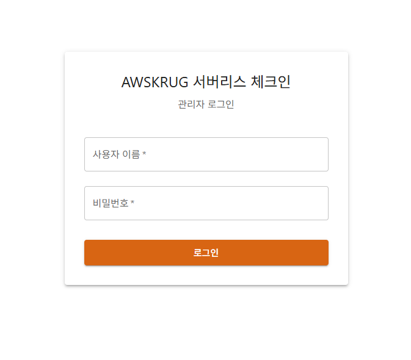
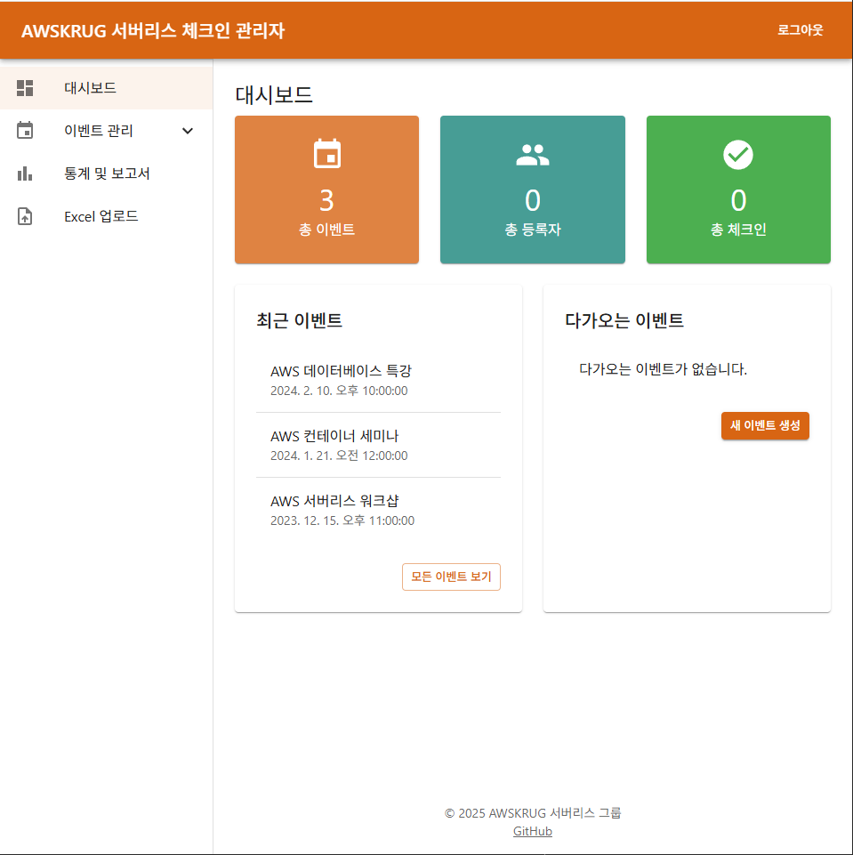
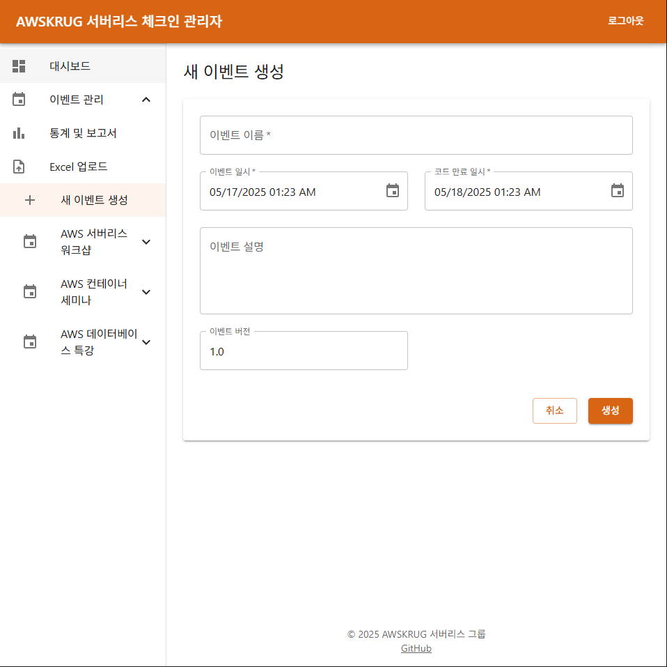
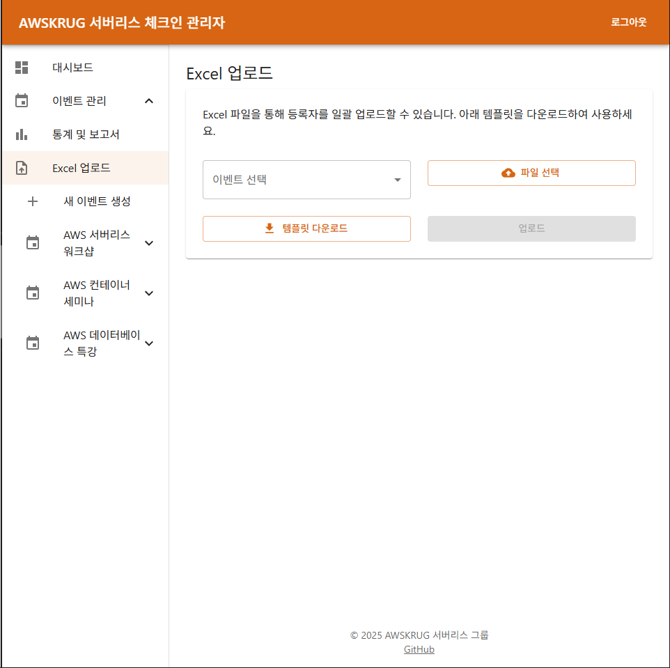
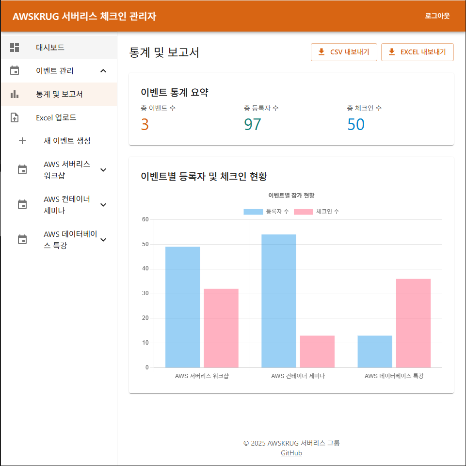

# AWSKRUG 서버리스 체크인 관리자 프론트엔드 문서

이 문서는 AWSKRUG 서버리스 체크인 시스템의 관리자 프론트엔드 구현에 대한 가이드라인을 제공합니다.

## 개요

관리자 프론트엔드는 이벤트 관리, 참가자 등록 관리, 체크인 관리 및 통계 보고서 기능을 제공하는 웹 애플리케이션입니다. 백엔드 API와 통신하여 데이터를 가져오고 업데이트합니다.

## Frontend Setup
```
cd admin
yarn install
yarn build
yarn start
```

## ENV
```
# API URL
REACT_APP_API_URL=https://api.example.com

# Environment (local시 Front Mockup Test, 아니면 서버 API URL을 타도록 구성됨)
REACT_APP_ENV=local

# Authentication
REACT_APP_AUTH_REGION=ap-northeast-2
REACT_APP_USER_POOL_ID=ap-northeast-2_xxxxxxxx
REACT_APP_USER_POOL_WEB_CLIENT_ID=xxxxxxxxxxxxxxxxxxxxxxxxxx
```

### Mock-up 상태시 login id/pw : admin / password

## 기술 스택

- **프레임워크**: React.js
- **UI 라이브러리**: Material-UI 또는 Ant Design
- **상태 관리**: Redux 또는 Context API
- **API 통신**: Axios
- **인증**: Amazon Cognito (예상)
- **차트 및 시각화**: Chart.js 또는 Recharts

## 페이지 구성

### 1. 로그인 페이지

- 관리자 인증을 위한 로그인 폼
- 사용자 이름/이메일 및 비밀번호 입력 필드
- 로그인 버튼
- 비밀번호 찾기 링크

### 2. 대시보드

- 최근 이벤트 요약 정보
- 주요 통계 (총 이벤트 수, 총 등록자 수, 총 체크인 수)
- 최근 체크인 활동
- 다가오는 이벤트 알림

### 3. 이벤트 관리

#### 3.1 이벤트 목록

- 모든 이벤트 테이블 형식 표시
- 날짜 범위 필터링 옵션
- 각 이벤트에 대한 기본 정보 (코드, 이름, 날짜, 참가자 수, 체크인 수)
- 이벤트 생성, 편집, 삭제 버튼
- 이벤트 상세 페이지로 이동 링크

#### 3.2 이벤트 생성/편집

- 이벤트 이름 입력 필드
- 이벤트 날짜 및 시간 선택기
- 코드 만료 날짜 및 시간 선택기
- 이벤트 설명 텍스트 영역
- 이벤트 버전 입력 필드
- 저장 및 취소 버튼

#### 3.3 이벤트 상세

- 이벤트 기본 정보 표시
- QR 코드 이미지 표시 및 다운로드 옵션
- QR 코드 재생성 버튼
- 등록자 및 체크인 탭으로 전환 옵션
- 통계 요약 정보

### 4. 등록 관리

#### 4.1 등록자 목록

- 특정 이벤트의 모든 등록자 테이블 형식 표시
- 이름, 전화번호(마스킹 처리), 이메일 정보
- 검색 및 필터링 옵션
- 등록자 추가 및 삭제 버튼
- Excel 파일 업로드 버튼

#### 4.2 등록자 추가

- 이름 입력 필드
- 전화번호 입력 필드 (형식 검증 포함)
- 이메일 입력 필드 (형식 검증 포함)
- 저장 및 취소 버튼

#### 4.3 Excel 업로드

- 파일 선택 드롭 영역
- 업로드 진행 상태 표시
- 업로드 결과 요약 (처리된 행 수, 성공/실패 항목)
- 템플릿 파일 다운로드 옵션

### 5. 체크인 관리

#### 5.1 체크인 목록

- 특정 이벤트의 모든 체크인 테이블 형식 표시
- 이름, 전화번호(마스킹 처리), 체크인 시간 정보
- 검색 및 필터링 옵션
- 수동 체크인 버튼
- 체크인 삭제 옵션

#### 5.2 수동 체크인

- 전화번호 입력 필드
- 등록자 검색 기능
- 체크인 확인 버튼
- 체크인 결과 표시

### 6. 통계 및 보고서

#### 6.1 이벤트 통계

- 등록자 수 및 체크인 수 그래프
- 출석률 표시
- 시간별 체크인 분포 차트
- 주요 통계 수치 요약

#### 6.2 데이터 내보내기

- 내보내기 형식 선택 (CSV/Excel)
- 내보내기 범위 선택 (모든 데이터/체크인만/등록자만)
- 다운로드 버튼

## 컴포넌트 구조

### 공통 컴포넌트

1. **Header**: 로고, 네비게이션 메뉴, 사용자 정보 표시
2. **Sidebar**: 주요 메뉴 항목 및 네비게이션 링크
3. **Footer**: 저작권 정보, 버전 정보
4. **DataTable**: 재사용 가능한 테이블 컴포넌트 (정렬, 필터링, 페이지네이션 포함)
5. **Modal**: 다양한 작업을 위한 모달 다이얼로그
6. **Form**: 재사용 가능한 폼 컴포넌트 및 유효성 검사
7. **Alert**: 성공/오류 메시지 표시
8. **Loading**: 로딩 상태 표시
9. **QRCode**: QR 코드 표시 및 다운로드 컴포넌트
10. **DatePicker**: 날짜 및 시간 선택 컴포넌트
11. **FileUpload**: 파일 업로드 컴포넌트

### 페이지별 컴포넌트

각 페이지에 필요한 특정 컴포넌트들을 구현합니다.

## 라우팅 구조

```
/login                       # 로그인 페이지
/dashboard                   # 대시보드
/events                      # 이벤트 목록
/events/new                  # 이벤트 생성
/events/:eventCode           # 이벤트 상세
/events/:eventCode/edit      # 이벤트 편집
/events/:eventCode/registrations  # 등록자 목록
/events/:eventCode/checkins  # 체크인 목록
/events/:eventCode/stats     # 이벤트 통계
/upload                      # Excel 업로드
```

## API 연동

백엔드 API와의 연동을 위한 서비스 모듈을 구현합니다:

1. **AuthService**: 로그인, 로그아웃, 토큰 관리
2. **EventService**: 이벤트 CRUD 작업
3. **RegistrationService**: 등록자 관리 작업
4. **CheckinService**: 체크인 관리 작업
5. **StatisticsService**: 통계 및 보고서 작업

## 상태 관리

Redux 또는 Context API를 사용하여 다음 상태를 관리합니다:

1. **Auth State**: 현재 로그인 상태 및 사용자 정보
2. **Events State**: 이벤트 목록 및 현재 선택된 이벤트
3. **Registrations State**: 등록자 목록 및 필터링 상태
4. **Checkins State**: 체크인 목록 및 필터링 상태
5. **UI State**: 로딩 상태, 오류 메시지, 모달 표시 여부

## 반응형 디자인

다양한 화면 크기에 대응하는 반응형 디자인을 구현합니다:

1. **데스크톱**: 풀 기능 레이아웃
2. **태블릿**: 최적화된 레이아웃, 일부 기능 간소화
3. **모바일**: 핵심 기능 중심의 간소화된 레이아웃

## 보안 고려사항

1. **인증 및 권한 부여**: Amazon Cognito를 통한 사용자 인증
2. **토큰 관리**: JWT 토큰 안전한 저장 및 갱신
3. **HTTPS**: 모든 API 통신은 HTTPS를 통해 이루어짐
4. **입력 유효성 검사**: 모든 사용자 입력에 대한 클라이언트 측 유효성 검사
5. **민감 정보 처리**: 전화번호 등 민감 정보의 마스킹 처리

## 구현 우선순위

1. **필수 기능**:
   - 로그인 및 인증
   - 이벤트 목록 및 상세 보기
   - 등록자 목록 및 Excel 업로드
   - 체크인 목록 및 수동 체크인

2. **중요 기능**:
   - 이벤트 생성 및 편집
   - 통계 및 보고서
   - QR 코드 관리

3. **추가 기능**:
   - 고급 필터링 및 검색
   - 데이터 내보내기
   - 대시보드 커스터마이징

## 테스트 전략

1. **단위 테스트**: 주요 컴포넌트 및 서비스에 대한 단위 테스트
2. **통합 테스트**: API 연동 및 상태 관리 테스트
3. **E2E 테스트**: 주요 사용자 흐름에 대한 엔드투엔드 테스트
4. **반응형 테스트**: 다양한 화면 크기에서의 UI 테스트

## 배포 전략

1. **개발 환경**: 로컬 개발 및 테스트
2. **스테이징 환경**: 백엔드 API와 통합 테스트
3. **프로덕션 환경**: AWS Amplify 또는 S3+CloudFront를 통한 배포

## 결론

이 문서는 AWSKRUG 서버리스 체크인 시스템의 관리자 프론트엔드 구현을 위한 가이드라인을 제공합니다. 백엔드 API와 연동하여 효율적인 이벤트 관리, 등록자 관리, 체크인 관리 및 통계 보고서 기능을 제공하는 웹 애플리케이션을 구현하는 것이 목표입니다.

## Front Sample





