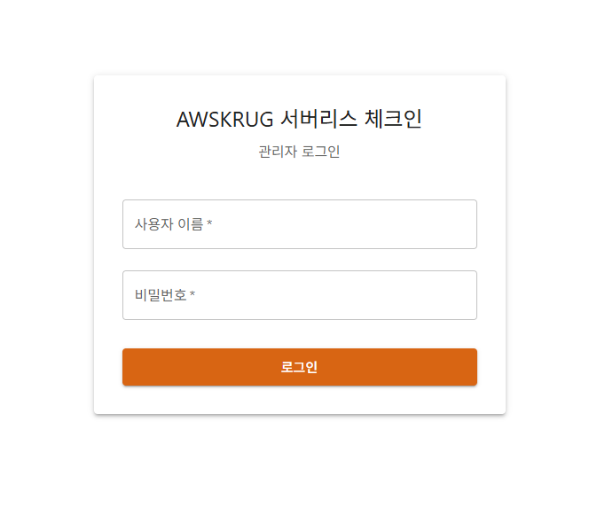
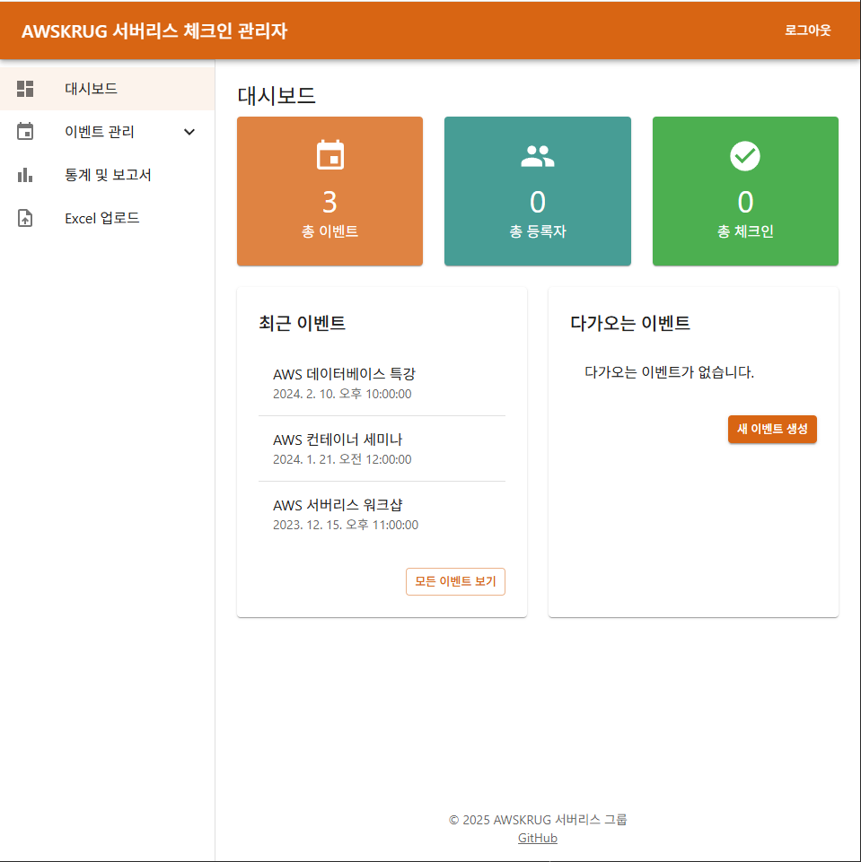
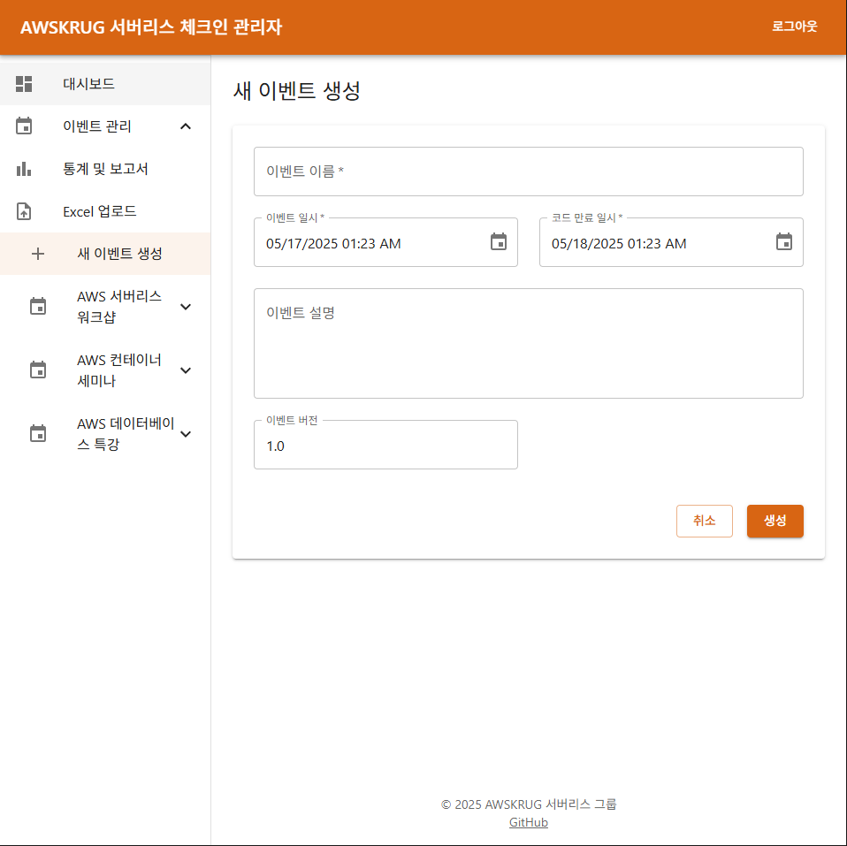
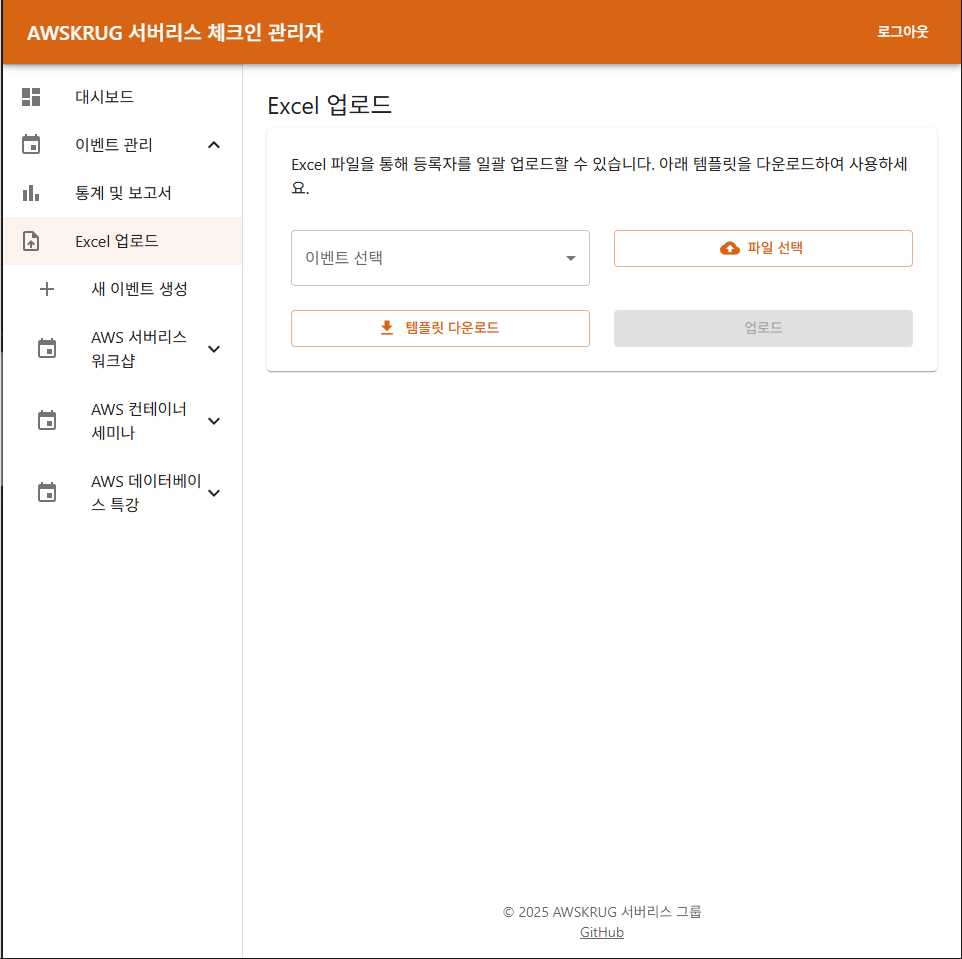
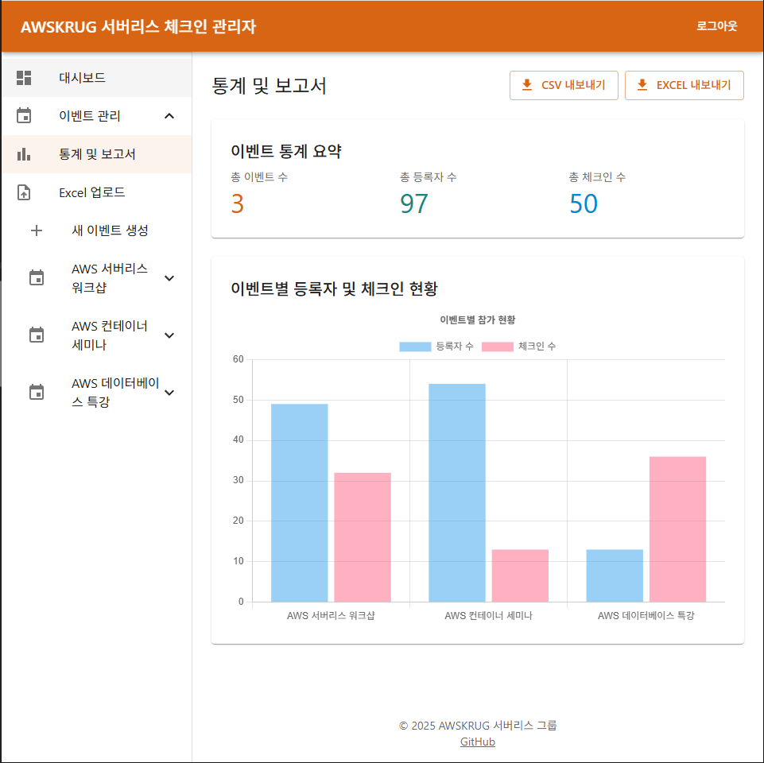

# AWSKRUG 서버리스 체크인 관리자 (Admin Sunny)

AWSKRUG 서버리스 체크인 시스템의 관리자 웹 애플리케이션입니다. 이벤트 및 소모임 관리, 참가자 등록, 체크인 관리, 통계 조회 기능을 제공합니다.

## 주요 기능

- **이벤트 관리**: 이벤트 및 소모임 생성, 수정, 삭제
- **참가자 관리**: 등록자 목록 조회 및 Excel 일괄 업로드
- **체크인 관리**: 실시간 체크인 현황 조회 및 수동 체크인
- **통계 및 리포트**: 이벤트별 참석률, 시간대별 체크인 분포 등 시각화
- **QR 코드 관리**: 이벤트별 QR 코드 생성 및 다운로드

## 기술 스택

- **Framework**: React 18.2
- **UI Library**: Material-UI (MUI) 5.14
- **State Management**: React Context API
- **HTTP Client**: Axios
- **Routing**: React Router DOM 6
- **Charts**: Chart.js, Recharts
- **Date Handling**: Day.js
- **Build Tool**: React Scripts (Create React App)

## 설치 및 실행

### 1. 의존성 설치

```bash
npm install
# or
yarn install
```

### 2. 환경 변수 설정

`.env` 파일을 생성하고 다음 내용을 설정합니다:

```bash
# API URL
REACT_APP_API_URL=https://your-api-url.lambda-url.ap-northeast-2.on.aws

# Environment (development/production)
REACT_APP_ENV=development

# Authentication (선택사항)
REACT_APP_AUTH_REGION=ap-northeast-2
REACT_APP_USER_POOL_ID=ap-northeast-2_xxxxxxxx
REACT_APP_USER_POOL_WEB_CLIENT_ID=xxxxxxxxxxxxxxxxxxxxxxxxxx
```

`.env.example` 파일을 참고하여 설정할 수 있습니다.

### 3. 개발 서버 실행

```bash
npm start
# or
yarn start
```

브라우저에서 [http://localhost:3000](http://localhost:3000)으로 접속합니다.

### 4. 프로덕션 빌드

```bash
npm run build
# or
yarn build
```

빌드된 파일은 `build` 디렉토리에 생성됩니다.

## Mock 모드

개발 환경에서 백엔드 없이 테스트하려면 `REACT_APP_ENV=local`로 설정하면 Mock 데이터로 동작합니다.

**Mock 로그인 정보**:
- ID: `admin`
- Password: `password`

## 프로젝트 구조

```
admin_sunny/
├── public/              # 정적 파일
├── src/
│   ├── components/      # 공통 컴포넌트
│   │   └── common/      # Header, Sidebar, Footer 등
│   ├── pages/           # 페이지 컴포넌트
│   │   ├── login/       # 로그인
│   │   ├── dashboard/   # 대시보드
│   │   ├── events/      # 이벤트 관리
│   │   ├── groups/      # 소모임 관리
│   │   ├── registrations/ # 참가자 등록
│   │   ├── checkins/    # 체크인 관리
│   │   ├── stats/       # 통계 및 리포트
│   │   └── upload/      # Excel 업로드
│   ├── services/        # API 서비스
│   │   ├── api.js       # Axios 인스턴스 설정
│   │   ├── authService.js
│   │   ├── eventService.js
│   │   ├── groupService.js
│   │   ├── registrationService.js
│   │   ├── checkinService.js
│   │   ├── statisticsService.js
│   │   ├── organizationService.js
│   │   ├── uploadService.js
│   │   └── mockData.js  # Mock 데이터
│   ├── contexts/        # React Context
│   ├── App.js           # 메인 애플리케이션
│   ├── config.js        # 설정 파일
│   └── index.js         # 엔트리 포인트
├── .env                 # 환경 변수 (git ignored)
├── .env.example         # 환경 변수 예제
├── package.json
└── README.md
```

## 주요 페이지

### 1. 로그인 (`/login`)
- 관리자 인증 및 로그인

### 2. 대시보드 (`/dashboard`)
- 전체 이벤트 현황 요약
- 주요 통계 (이벤트 수, 총 등록자 수, 총 체크인 수)
- 최근 활동 내역

### 3. 이벤트 관리 (`/events`)
- 이벤트 목록 조회
- 이벤트 생성, 수정, 삭제
- QR 코드 생성 및 다운로드
- 이벤트별 등록자 및 체크인 관리

### 4. 소모임 관리 (`/groups`)
- 소모임 목록 조회 및 관리
- 소모임별 이벤트 연계

### 5. 참가자 관리 (`/registrations`)
- 이벤트별 등록자 목록 조회
- 등록자 추가, 수정, 삭제
- Excel 일괄 등록

### 6. 체크인 관리 (`/checkins`)
- 실시간 체크인 현황
- 수동 체크인 처리
- 체크인 내역 조회

### 7. 통계 (`/stats`)
- 이벤트별 참석률 통계
- 시간대별 체크인 분포
- 차트 및 그래프 시각화
- 데이터 내보내기 (Excel)

### 8. Excel 업로드 (`/upload`)
- 참가자 일괄 등록을 위한 Excel 업로드
- 템플릿 다운로드
- 업로드 결과 확인

## API 서비스

프로젝트는 다음 서비스 모듈로 백엔드 API와 통신합니다:

- **authService**: 로그인/로그아웃
- **eventService**: 이벤트 CRUD
- **groupService**: 소모임 관리
- **registrationService**: 참가자 등록 관리
- **checkinService**: 체크인 처리
- **statisticsService**: 통계 데이터 조회
- **uploadService**: 파일 업로드
- **organizationService**: 조직 관리

## 개발 가이드

### 환경 변수

- `REACT_APP_API_URL`: 백엔드 API URL
- `REACT_APP_ENV`: 환경 설정 (local/development/production)
- `REACT_APP_AUTH_REGION`: AWS 리전
- `REACT_APP_USER_POOL_ID`: Cognito User Pool ID
- `REACT_APP_USER_POOL_WEB_CLIENT_ID`: Cognito Web Client ID

### 로컬 개발

```bash
# 개발 서버 시작 (Mock 모드)
REACT_APP_ENV=local npm start

# 개발 서버 시작 (API 연동)
REACT_APP_ENV=development npm start
```

### 빌드 및 배포

```bash
# 프로덕션 빌드
npm run build

# AWS S3 + CloudFront 또는 Amplify로 배포
```

## 스크린샷

### 로그인


### 대시보드


### 이벤트 생성


### Excel 업로드


### 통계


## 기여 및 지원

문제가 발생하거나 개선 사항이 있다면 이슈를 등록해주세요.

## 라이선스

이 프로젝트는 AWSKRUG 서버리스 모임을 위해 개발되었습니다.
